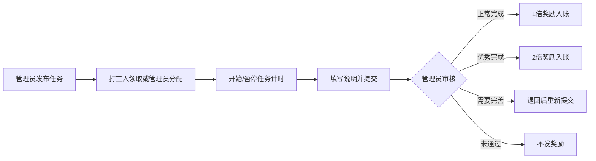
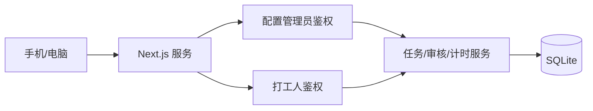

# 「PEN子打工人」开发计划

> 文档版本：v0.9
>
> 更新日期：2026-07-20
>
> 实施原则：先做简单可靠的单管理员 MVP，需要时再扩展

## 1. 项目目标

「PEN子打工人」是一款面向小学生和家庭使用的时间奖励网页应用：

- 管理员发布奖励任务。
- 打工人参加任务、计时、完成并提交。
- 所有由打工人领取或自主申报的奖励任务必须经过管理员审核，审核通过后才真正获得时数；管理员快速补录的记录由管理员当场确认。
- 管理员可以根据发布时的规则给予正常奖励或双倍奖励。
- 打工人玩游戏、看视频时，通过计时消耗已有时数。
- 每个打工人每天自动获得管理员为其配置的固定时数，默认 2 小时。
- 数据保存在服务端 SQLite，不同设备访问同一地址时看到相同数据。
- 界面采用适合小学生的卡通风格，并优先保证手机端易操作。
- 角色支持系统图标或照片头像；照片压缩后保存到 SQLite，跨设备保持一致。

第一版只支持一个管理员，但可以有多个打工人。管理员密码放在服务端配置文件中，不创建管理员数据库账号；以后需要多管理员时再扩展正式账号系统。

## 2. 简化后的角色设计

### 2.1 管理员

管理员身份固定为系统唯一管理员，密码从服务端配置读取。管理员可以：

- 创建、编辑、停用打工人，并设置或重置其独立密码/PIN。
- 为角色上传、替换或恢复照片头像。
- 为每个打工人设置每日固定奖励，默认 2 小时。
- 发布、关闭和复制奖励任务。
- 指定任务对全部或某个打工人开放。
- 直接将任务分配给打工人。
- 查看全部打工人的任务、计时、余额和明细。
- 代打工人开始、暂停或结束计时。
- 撤销尚未入账的误领、误分配或误提交任务。
- 修正尚未入账任务的累计时长，并保留修正记录。
- 代打工人直接填写不计时的消耗。
- 取消正在运行的误触消耗，或原额撤销已经结算的消费明细。
- 审核任务，选择正常奖励、双倍奖励、退回完善或未通过。
- 从首页或角色卡片快速补录已经完成但未及时录入的奖励；补录由管理员直接确认，立即记入任务奖励明细。
- 管理“玩游戏”“看视频”等消耗项目。
- 对错误账目进行有原因、有记录的余额调整。

管理员不拥有时数钱包，也不能删除历史交易。

### 2.2 打工人

每个打工人保存在 SQLite 中，并拥有自己的头像、主题色和独立密码/PIN。打工人可以：

- 查看和领取管理员发布给自己的任务。
- 为自己的任务开始、暂停和结束计时。
- 填写简单完成说明并提交审核。
- 查看待审核、退回完善、已奖励等状态。
- 查看自己的时数余额和明细。
- 开始或结束管理员允许的消耗项目。
- 取消自己尚未提交的任务，并可在暂停计时后修正累计时长。
- 直接填写不计时的消耗，填写后立即扣除余额。
- 开始消耗后的 30 秒内取消误触，本次不产生扣款。

打工人不能发布任务、修改奖励、审核自己或访问其他打工人的数据。

### 2.3 系统自动操作

- 每天按各打工人的独立配置发放固定时数，默认 2 小时。
- 使用服务端时间计算所有计时。
- 保证同一打工人同一时间只有一个活动计时器。
- 余额耗尽时自动停止消耗。
- 使用事务保证审核入账、扣款和明细同步完成。

## 3. 管理员配置与登录

### 3.1 配置方式

开发环境使用项目根目录的 `.env.local`，生产环境使用仅服务器可读的环境变量或环境文件：

```dotenv
ADMIN_PASSWORD=请在这里设置管理员密码
SESSION_SECRET=请填写至少32位随机字符串
APP_TIMEZONE=Asia/Shanghai
DATABASE_PATH=./data/pen-worker.db
SESSION_MAX_AGE_DAYS=180
COOKIE_SECURE=false
ALLOWED_DEV_ORIGINS=10.10.10.5
```

要求：

- `.env.local` 必须加入 `.gitignore`，不能提交真实密码。
- 仓库只提交 `.env.example`，其中使用占位值。
- `ADMIN_PASSWORD` 缺失时，应用拒绝启动管理员功能并显示明确配置错误。
- 管理员密码可以直接修改配置后重启服务，不需要进入初始化页面。
- 管理员机制保持简单，但如果服务公开到互联网，仍建议使用不容易猜到的密码和 HTTPS。
- 局域网开发来源通过 `ALLOWED_DEV_ORIGINS` 配置；多个主机名或 IP 使用英文逗号分隔，修改后重启开发服务器。

### 3.2 登录状态

- 管理员登录时由服务端读取 `ADMIN_PASSWORD`，使用恒定时间方法比较。
- 打工人密码使用 Node.js `crypto.scrypt` 加随机盐哈希后保存到 SQLite。
- 登录成功后，把持久登录状态写入经过签名的 `HttpOnly` Cookie。
- Cookie 可以记录当前设备已经验证过的管理员和少量打工人 ID，因此同一设备切换到已登录角色时无需重复输入密码。
- Cookie 不保存任何明文密码、密码哈希、余额或任务内容。
- Cookie 默认保留 180 天；清除浏览器数据后需要重新登录。
- 管理员授权中保存由 `SESSION_SECRET` 对当前 `ADMIN_PASSWORD` 计算的指纹。管理员密码修改并重启后，旧 Cookie 中的管理员授权自动失效。
- 打工人记录 `auth_version`；修改或重置打工人密码时递增版本，使其旧登录自动失效。
- 提供“退出当前角色”和“清除本机全部登录”。第一版不实现远程设备会话管理。

### 3.3 首次使用

- 应用启动时自动创建数据库、执行 migration，并初始化“玩游戏”“看视频”两个消耗项目。
- 管理员直接使用配置文件中的密码登录，不创建管理员资料。
- 如果数据库还没有打工人，管理员首页显示一个简单的“创建第一个打工人”表单。
- 创建时填写名称、选择头像和主题色，设置独立密码或 4～8 位数字 PIN；每日奖励默认带入 2 小时，也可立即修改。
- 已有角色时，创建表单默认收起并放在角色列表下方；没有角色时自动展开。
- 不需要额外的初始化向导或管理员创建步骤。

## 4. 奖励任务流程

### 4.1 标准流程



任务状态使用：

- `claimed`：已领取。
- `in_progress`：进行中。
- `submitted`：待审核。
- `revision_requested`：需要完善。
- `approved`：审核通过并已奖励。
- `rejected`：未通过。
- `cancelled`：已取消。

### 4.2 管理员发布任务

管理员发布时填写：

- 任务名称和简短说明。
- 基础奖励时数。
- 面向全部打工人或指定打工人。
- 开始领取时间和截止时间，可留空。
- 计时方式：不需要、可选或必须计时。
- 必须计时时的最低有效时长，可留空。
- 是否允许优秀完成获得双倍奖励。
- 如果允许双倍，必须写清楚优秀标准。

第一版不建立复杂的模板与周期系统。发布页提供“读书、运动、做好事、得奖、编程、做家务”快捷填充项，管理员确认后直接发布；需要重复任务时使用“复制任务”。

一旦已有打工人领取，不允许修改奖励、双倍条件和计时要求。管理员应关闭旧任务并复制为新任务，避免领取后的规则被改变。

### 4.3 领取和计时

- 打工人只能看到发布给自己且尚未关闭的任务。
- 每个打工人对同一发布任务默认只能领取一次。
- 管理员也可以直接把任务分配给打工人。
- 领取时保存任务名称、基础奖励、双倍规则和截止时间快照。
- 打工人可以同时领取多个任务，但同一时间只能运行一个计时器。
- 奖励任务允许多次开始和暂停，每段时间都会保存。
- 管理员可以代为开始、暂停或结束计时，系统记录具体操作者。
- 浏览器只负责每秒更新显示，数据库只在开始、暂停和结束时写入。
- 关闭页面或更换设备后，根据服务端开始时间恢复计时。
- 任务计时只用于记录投入时间，不会自动产生奖励。
- 活动计时暂停后，打工人可修正自己的未提交任务累计时长；管理员可修正尚未最终入账的任务。修正以增减记录保存，不覆盖原始计时片段。
- 打工人可取消自己尚未提交的任务；管理员还可撤销待审核任务。已入账任务不可撤销，只能通过余额调整纠正。
- 取消后保留操作日志；同一发布任务可以重新领取，旧尝试的累计时长会清零。

### 4.4 提交任务

- 提交前自动结束该任务正在运行的计时器。
- 页面显示任务要求、累计计时、基础奖励和可能获得的双倍奖励。
- 打工人填写简短完成说明后提交。
- MVP 不上传照片或文件，后续再增加证明材料。
- 提交后进入“待审核”，预期奖励单独显示，但不能计入真实余额。
- 必须计时且未达到最低时长时不能提交；管理员可以填写原因后代为提交。

### 4.5 管理员审核

审核结果固定为四种：

| 审核结果 | 最终奖励 | 规则 |
| --- | ---: | --- |
| 正常完成 | 基础奖励 × 1 | 达到基本要求 |
| 优秀完成 | 基础奖励 × 2 | 发布时允许双倍且达到公开标准 |
| 退回完善 | 暂不奖励 | 打工人可以重新提交 |
| 未通过 | 0 | 本次任务结束 |

- 第一版只支持 1 倍和 2 倍，保持规则易懂。
- 未开启双倍奖励的任务，审核页不能选择 2 倍。
- 选择双倍、退回或未通过时必须填写原因。
- 最终奖励根据领取时的基础奖励快照计算。
- 审核通过时，在一个事务中写审核结果、增加余额和生成明细。
- 同一提交只能成功审核一次，多设备重复操作不会重复奖励。
- 已入账结果不直接修改；确需修正时创建一笔带原因的余额调整明细。

### 4.6 管理员审核台

- 显示待审核总数，并按最早提交优先排序。
- 支持按打工人和任务筛选。
- 审核卡显示任务要求、基础奖励、双倍条件、完成说明、累计计时和计时操作者。
- 审核完成后立即从待审核列表移除，并在打工人首页显示结果。

### 4.7 管理员快速补录奖励

当奖励任务已经完成、但管理员来不及提前发布任务时，不需要为了补录再创建一条完整任务流程。管理员可以在首页“快速补录奖励”或角色卡片入口填写：

- 发放给哪个打工人。
- 奖励任务名称和奖励分钟数。
- 可选的补录说明，例如完成日期或实际情况。

提交后在一个事务中增加余额，并以 `task_reward` 类型写入账本；说明默认标记为“管理员快速补录奖励”。这类记录已经由管理员确认，不进入待审核队列，也不会创建虚假的任务领取记录。请求使用幂等编号，网络重试不会重复发放。

## 5. 消耗任务与每日奖励

### 5.1 消耗项目

- 默认创建“玩游戏”和“看视频”，管理员可以创建、排序或停用其他项目。
- 打工人选择项目后开始计时，结束时按实际秒数扣除余额。
- 管理员可以代打工人开始或结束消耗计时，并记录操作者。
- 同一打工人不能同时进行奖励任务计时和消耗计时。
- 余额为 0 时不能开始消耗。
- 计时达到可用余额时自动结束，余额归零但不能为负数。
- 页面关闭后消耗继续；再次打开时恢复或自动结算。
- 打工人和管理员也可选择消耗项目并直接填写分钟数，不启动计时；系统校验余额后立即扣款并生成明细。
- 打工人开始消耗后的 30 秒内可选择“误触取消”，系统删除活动计时器并写操作日志，不生成消费明细。
- 管理员可随时取消仍在运行的误触消耗；已经结束并扣款的消耗由管理员从明细执行原额撤销。
- 已结算消耗的撤销使用补偿交易退回时数，不删除原消费；同一笔消费只能撤销一次。

消耗任务不进入管理员审核。审核用于确认是否应该发放奖励；消耗如果等待审核，会导致当前可用余额不准确。

### 5.2 每日固定奖励

- 每个打工人拥有独立的 `daily_reward_seconds` 配置，创建时默认是 2 小时，即 7,200 秒。
- 管理员可以在打工人详情页修改，提供“关闭、30 分钟、1 小时、2 小时”和“自定义”快捷选项。
- 自定义值以分钟为单位输入，允许 0～24 小时；设置为 0 表示关闭该打工人的每日奖励。
- 当天首次读取该打工人状态时自动发放，不需要管理员审核。
- 使用打工人时区计算自然日，默认 `Asia/Shanghai`。
- 不补发之前没有打开应用的日期。
- 使用 `(worker_id, reward_date)` 唯一约束避免多设备重复发放。
- 每日发放记录保存当天实际使用的奖励秒数快照。
- 修改配置不会追溯增减已经发放的奖励：如果今天已经产生每日发放记录，新设置从明天生效；如果今天尚未发放，则下一次访问使用新设置。
- 配置为 0 时仍创建金额为 0 的当日发放记录，防止同一天修改设置后重复触发；金额为 0 时不创建余额交易。
- 发放前先结算已经耗尽的消耗计时，防止新奖励被追溯用于昨天的消耗。

## 6. 时数账本与操作记录

真实余额变化只有四类：

- 每日固定奖励。
- 管理员审核通过的任务奖励。
- 消耗任务扣除。
- 管理员余额调整。

每条明细保存打工人、类型、标题、时数变化、变化后余额、关联任务、操作者、原因和时间。历史明细不可删除或覆盖。

管理员代计时、审核、退回、拒绝、双倍奖励、重置密码和余额调整需要写简洁的操作日志。第一版不制作复杂审计后台，只在相关详情页展示必要记录；完整审计后台后续扩展。

## 7. 儿童友好界面与手机操作

### 7.1 视觉方向

- 使用“铅笔小助手”作为卡通吉祥物。
- 把时数设计成带小时钟图案的“时间币”。
- 使用天空蓝、阳光黄、薄荷绿、珊瑚橙和葡萄紫等明快颜色。
- 卡片采用大圆角、适度粗描边和柔和阴影，避免密集装饰和闪烁。
- 收入使用绿色加号，消耗使用橙红色计时图标，但必须同时显示文字。
- 使用清晰的中文圆体或系统字体，正文不小于 16px。
- 奖励到账可以播放短暂动画，同时支持系统“减少动态效果”。
- MVP 只预留不可点击的“奖励”入口。后续随机时间券必须公开分钟范围，每日派发开关、张数和范围由管理员按角色设置，并避免付费次数、连续点击或诱导消费。

### 7.2 手机端

- 采用移动优先布局，最低适配 360px 宽度。
- 所有点击区域至少 48×48px，主要按钮高度 52～56px。
- 打工人底部导航统一使用双字标签：`首页`、`打工`、`进度`、`奖励（未开）`、`明细`、`我的`。
- 管理员底部导航统一使用双字标签：`总览`、`发布`、`审核`、`角色`、`设置`。
- 有计时运行时，在底部导航上方固定显示计时条和大号停止按钮。
- 任务、明细和审核使用纵向卡片，不使用手机宽表格。
- PIN 调起数字键盘；时长提供 10、20、30、60 分钟快捷项。
- 不依赖悬停、右键或隐藏手势，所有功能都有可见按钮。
- 请求处理中禁用重复点击，并适配 iPhone 安全区域和软键盘。

### 7.3 登录页

- 首屏展示打工人头像卡片和单独的“管理员入口”。
- 已在本机登录的角色点击后直接进入，未登录角色输入自己的密码/PIN。
- 页面显示“登录后会记住这台设备”，并提供清除本机登录入口。
- 角色卡不显示余额等私密信息。

### 7.4 打工人首页

- 使用“时间币小金库”大卡片展示真实余额。
- 分开显示今日获得、今日消耗和待审核奖励。
- 显示进行中任务、退回任务和最新审核结果。
- 使用大卡片提供“参加任务”和“开始消耗”入口。
- 双倍任务明确显示“优秀完成可得 ×2”和具体条件。
- 自主奖励申报使用弹窗打开，任务页只保留紧凑入口和待处理数量。
- “进行中”页同时显示任务奖励、累计计时、距离最低要求还差多久，以及当前剩余总时长。

### 7.5 预留奖励栏位

> 奖励系统的详细讨论稿见 [reward-system-plan.md](reward-system-plan.md)，包含随机时间券、固定时间券、实物券、管理员直接发放、每日按角色派券和任务多券组合等扩展设计。

- MVP 在打工人底部导航显示“奖励”，按钮保持禁用并直接标注“暂未开放”。
- 管理员后台创建随机时间券、固定时间券和实物券；随机券在管理员设置的范围内产生任意整数分钟，固定券设置时长，实物券设置说明、默认图标或自定义图片。
- 每个角色独立配置是否每日派发随机时间券、每日张数及分钟范围，并使用自然日唯一记录防止重复派发。
- 任务保留基础时间，并可分别绑定多种、多张普通奖励券和优秀额外奖励券；优秀完成只把基础时间翻倍，普通券不翻倍，再追加优秀奖励券。
- 当前所有券永久积累，已发券使用可空的到期时间字段，`NULL` 表示永久；以后可以只对新券启用有效期。
- 实物不参与随机。管理员交付实物后，由打工人在实物券上输入自己的当前密码确认收到并完成使用。
- 随机范围、固定时长、实物内容和当天派发情况都要清楚展示，不提供付费购买奖励券。

### 7.6 管理员首页

- 优先显示待审核数量、正在计时的打工人和今日余额变化。
- 打工人卡显示头像、余额、当前任务和计时状态。
- 可以从打工人详情代为操作计时。
- 打工人详情提供每日奖励设置，显示当前额度和今天是否已经发放。
- 审核页提供四个清晰按钮：正常奖励、双倍奖励、退回完善、未通过。

## 8. 技术方案

### 8.1 技术栈

- Next.js App Router、TypeScript、Tailwind CSS。
- SQLite 与 `better-sqlite3`。
- Zod 输入校验。
- Node.js `crypto.scrypt` 保存打工人密码。
- Vitest 单元与数据库集成测试。
- Playwright 关键流程测试。
- 带持久化磁盘的常驻 Node.js 服务或 Docker。

第一版不引入 ORM、实时服务、文件上传和复杂账号框架。业务 SQL 集中到数据访问层，页面组件不能直接执行 SQL。

### 8.2 服务结构



- SQLite 是业务数据唯一来源，`localStorage` 不保存余额、密码或明细。
- `better-sqlite3` 只运行在 Node.js runtime，不使用 Edge runtime。
- 状态和计时接口禁用缓存。
- 页面在可见时每 10～15 秒同步一次，并在重新聚焦时立即同步，满足简单的跨设备更新。
- SQLite 启用 WAL、外键和 `busy_timeout`。

## 9. 简化数据库设计

### 9.1 `workers`

保存打工人的名称、头像、主题色、密码哈希、`auth_version`、余额、`daily_reward_seconds`、时区和启用状态。`daily_reward_seconds` 默认为 7,200，并限制在 0～86,400 秒。管理员不保存在该表。

### 9.2 `tasks`

保存管理员发布的奖励任务：标题、说明、基础奖励、目标打工人、计时方式、最低时长、双倍开关、双倍条件、领取时间、截止时间和发布状态。

目标为全部打工人时 `target_worker_id` 为空；只发给某人时保存其 ID。第一版如果要同时指定多个但不是全部，管理员复制任务分别发布，后续再增加多目标关联表。

### 9.3 `task_assignments`

保存任务与打工人的领取关系、规则快照、当前状态、完成说明、提交时间、审核倍数、审核意见、审核时间和入账交易 ID。

为 `(task_id, worker_id)` 建立唯一索引，并使 `approved_transaction_id` 唯一，防止重复领取和重复奖励。

### 9.4 `active_timers`

每个打工人最多一条，记录计时类型、奖励任务或消耗项目、服务端开始时间、开始操作者和请求 ID。计时类型为 `reward_task` 或 `consumption`。

### 9.5 `timer_segments`

保存每段已结束计时的开始时间、结束时间、有效秒数、目标任务、开始操作者和结束操作者。

### 9.6 `timer_adjustments`

保存奖励任务累计时长的正负修正值、操作者、原因和请求 ID。最终累计时长为计时片段总和加修正值，最低为 0；原始计时片段不会被覆盖。

### 9.7 `consumption_activities`

保存玩游戏、看视频等消耗项目的名称、图标、排序和启用状态。

### 9.8 `transactions`

保存打工人、类型、标题、时数变化、变化后余额、关联任务或消耗项目、操作者、原因、请求 ID 和时间。

### 9.9 `daily_grants`

保存打工人、自然日、当天奖励秒数快照和对应交易 ID；奖励为 0 时交易 ID 为空。为 `(worker_id, reward_date)` 建立唯一索引。

### 9.10 `transaction_reversals`

保存原消费交易、退款交易、操作者、原因和请求 ID。原消费交易 ID 唯一，保证同一笔消耗最多撤销一次。

### 9.11 `worker_avatar_images`

保存角色的头像 MIME 类型、压缩后的图片二进制和更新时间。每个角色最多一张，删除记录后恢复系统图标；图片通过独立只读接口提供给登录页和各角色页面。

### 9.12 `audit_logs`

保存需要追溯的管理员动作、目标、原因和时间。第一版只记录关键动作，不做复杂的状态快照系统。

## 10. 关键事务规则

### 10.1 审核入账

1. 校验当前登录身份为管理员。
2. 在写事务中读取处于待审核状态的任务。
3. 校验 2 倍是否符合任务规则。
4. 计算最终奖励并更新审核状态。
5. 增加余额、写交易和操作日志。
6. 把交易 ID 写回领取记录后提交事务。

任何一步失败都回滚，同一任务不能重复入账。

### 10.2 计时

- 开始前检查该打工人没有其他活动计时器。
- 使用服务端时间创建计时器，记录管理员或打工人操作者。
- 暂停/结束时写计时片段并删除活动计时器。
- 消耗计时结束时在同一事务中扣款和写明细。
- 实际扣款为经过时间与余额中的较小值。

### 10.3 每日奖励

- 先自动结算已经耗尽的消耗计时。
- 读取该打工人的 `daily_reward_seconds`，并尝试插入带金额快照的当日唯一发放记录。
- 只有插入成功且配置金额大于 0 时，才增加对应秒数并写明细。
- 配置金额为 0 时只保存当日发放记录，不改变余额。

## 11. API 范围

### 管理员

- `POST /api/admin/login`
- `POST /api/admin/logout`
- `GET/POST/PATCH /api/admin/workers`
- `GET/POST/PATCH /api/admin/tasks`
- `POST /api/admin/tasks/:id/assign`
- `GET /api/admin/reviews`
- `POST /api/admin/assignments/:id/review`
- `POST /api/admin/workers/:id/timer/start`
- `POST /api/admin/workers/:id/timer/stop`
- `POST /api/admin/workers/:id/adjustment`

### 打工人

- `POST /api/workers/:id/login`
- `POST /api/workers/:id/logout`
- `GET /api/worker/state`
- `GET /api/worker/tasks`
- `POST /api/worker/tasks/:id/claim`
- `POST /api/worker/assignments/:id/timer/start`
- `POST /api/worker/assignments/:id/timer/pause`
- `POST /api/worker/assignments/:id/submit`
- `POST /api/worker/consumption/:id/start`
- `POST /api/worker/consumption/end`
- `GET /api/worker/transactions`

所有修改接口带客户端请求 ID，并返回服务端最新状态。接口必须从已签名 Cookie 判断当前身份，不能相信前端自行提交的管理员或打工人身份。

## 12. 实施顺序

### 阶段 1：骨架与 SQLite

- 初始化项目、数据库 migration 和默认消耗项目。
- 完成管理员配置读取、打工人表和签名 Cookie。

### 阶段 2：管理员与打工人登录

- 管理员使用配置密码登录。
- 管理员创建第一个打工人、设置 PIN 和每日奖励额度。
- 实现保持登录、角色切换、密码重置和权限保护。

### 阶段 3：发布、领取与计时

- 实现任务发布、领取、管理员分配和规则快照。
- 实现统一活动计时器、计时片段和管理员代计时。

### 阶段 4：提交、审核与账本

- 实现提交、1 倍、2 倍、退回、拒绝和原子入账。
- 实现管理员快速补录遗漏奖励，并以任务奖励明细原子入账。
- 实现每日奖励、消耗扣款、明细和余额调整。

### 阶段 5：卡通手机界面

- 完成管理员和打工人两套底部导航。
- 完成任务卡、固定计时条、审核卡和儿童友好反馈。

### 阶段 6：测试与部署

- 测试权限、重复审核、跨设备计时、余额耗尽和每日奖励。
- 完成 Docker、持久化目录、备份和部署说明。

## 13. MVP 验收清单

- [ ] 管理员直接使用配置文件密码登录，不需要创建管理员。
- [ ] 修改管理员密码并重启后，旧管理员登录自动失效。
- [ ] 管理员可以创建打工人，每个打工人有独立密码/PIN。
- [ ] 登录后当前设备保持登录，Cookie 中没有明文密码。
- [ ] 管理员可以发布任务，打工人只能领取属于自己的任务。
- [ ] 打工人可以计时和提交，但不能给自己增加时数。
- [ ] 打工人领取或自主申报的奖励必须审核通过后才入账；管理员快速补录可直接入账并留痕。
- [ ] 允许双倍的任务可审核为 2 倍，其他任务不能选择 2 倍。
- [ ] 管理员可以代打工人操作计时，并保留操作者记录。
- [ ] 未入账任务可以按权限撤销并重新领取，已入账任务不能静默撤销。
- [ ] 管理员和打工人可以修正允许范围内的任务累计时长，且原始计时片段保留。
- [ ] 同一打工人不能同时运行两个计时器。
- [ ] 每个打工人默认每日奖励 2 小时，管理员可独立改为 1 小时、其他时长或关闭。
- [ ] 每日奖励按当天金额快照只处理一次，修改设置不会追溯修改已发放金额。
- [ ] 消耗结束立即扣款，余额不能小于 0。
- [ ] 管理员和打工人可以直接填写不计时消耗，扣款与明细在同一事务完成。
- [ ] 误触消耗可在权限范围内取消；已经扣款的消耗只能由管理员原额撤销一次，原记录保留。
- [ ] 待审核奖励不计入真实余额。
- [ ] 手机端 360px 宽度可用，主要按钮不小于 48×48px。
- [ ] 手机和电脑访问同一服务器时数据一致。
- [ ] 服务重启后 SQLite 数据仍然存在。
- [ ] 类型检查、测试和生产构建全部通过。

## 14. 后续扩展

MVP 完成后再按需要增加：

- 多管理员和管理员权限分级。
- 数据库设备会话与远程撤销。
- 一个任务同时指定多个但非全部打工人。
- 周期任务、任务模板和批量发布。
- 照片或文件证明。
- 1.5 倍等更多奖励档位。
- 推送通知、报表、成就和 PWA。
- 启用“奖励”栏位：三类奖励券模板、每日按角色派券、管理员直接发放、任务多券组合和实物密码确认流程。

第一版优先完成“管理员发布 → 打工人执行 → 管理员审核 → 时数入账 → 消耗时数”这一条可靠闭环，不为暂时用不到的扩展增加复杂度。
